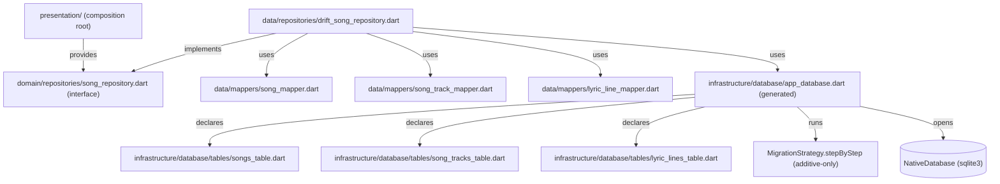

# Library Persistence Design

**Spec**: `.specs/features/library-persistence/spec.md`
**Status**: Approved

---

## Architecture Overview

`domain/` defines the `SongRepository` contract and a small `Unit` type for void-like success values — it imports nothing from `drift`. `data/` implements that contract, translating `drift`'s generated row classes to/from domain entities through thin mapper functions. `infrastructure/` owns the `drift` table declarations, the generated `AppDatabase` (via `build_runner` codegen), and the additive-only `stepByStep` migration. No layer above `data/` ever imports `package:drift`.

---

## Code Reuse Analysis

### Existing Components to Leverage

| Component | Location | How to Use |
|-----------|----------|------------|
| `Result<S, F>` | `lib/domain/core/result.dart` | Every repository method returns `Result<_, Failure>`; no new error-propagation mechanism needed |
| `Failure` subclasses | `lib/domain/core/failures.dart` | Reuse `StorageFailure` (DB errors) and `NotFoundFailure` (missing id) as-is — no new `Failure` subclass needed |
| `Song`, `SongTrack`, `LyricLine`, `MetronomeConfig`, `Naipe` | `lib/domain/entities/`, `lib/domain/entities/naipe.dart` | Mappers convert directly to/from these; no changes to the entities themselves |

### Integration Points

| System | Integration Method |
|--------|---------------------|
| SQLite file | `infrastructure/database/app_database.dart` opens it via `path_provider`'s app documents directory + `drift`'s `driftDatabase(name: 'cantae.db')` native connection helper |
| Riverpod composition root | A future `presentation/` provider wires `DriftSongRepository` behind `SongRepository` — out of scope for this phase (no UI yet), but the interface is designed so that wiring is a one-line `Provider` later |

---

## Components

### `Unit` (new)

- **Purpose**: Concrete success-value type for repository methods that have nothing to return but must still produce a `Result<S, F>`.
- **Location**: `lib/domain/core/unit.dart`
- **Interfaces**: `const Unit()` — single value, structurally equal to itself (no fields).
- **Dependencies**: none.
- **Reuses**: fits directly into the existing `Result<S, F>` sealed class without changes.

### `SongRepository` (interface, new)

- **Purpose**: Domain-facing contract for persisting and retrieving songs. Pure Dart — no `drift` import.
- **Location**: `lib/domain/repositories/song_repository.dart`
- **Interfaces**:
  - `Future<Result<Unit, StorageFailure>> save(Song song)` — upsert.
  - `Future<Result<Song, Failure>> getById(String id)` — `NotFoundFailure` if absent.
  - `Future<Result<List<Song>, StorageFailure>> getAll()`
  - `Future<Result<Unit, Failure>> delete(String id)` — `NotFoundFailure` if absent.
  - `Future<Result<Unit, StorageFailure>> deleteAll()`
- **Dependencies**: `Song`, `Result`, `Failure` subclasses, `Unit`.
- **Reuses**: nothing further — this is the new contract.

### Table declarations (new): `SongsTable`, `SongTracksTable`, `LyricLinesTable`

- **Purpose**: `drift` `Table` subclasses — the single source of truth the code generator reads to produce typed row classes and SQL DDL.
- **Location**: `lib/infrastructure/database/tables/songs_table.dart`, `song_tracks_table.dart`, `lyric_lines_table.dart`
- **Interfaces**: each is a `class XTable extends Table { ... }` with typed columns (`text()`, `integer()`, `boolean()`, `.nullable()`, `.references(SongsTable, #id, onDelete: KeyAction.cascade)`).
- **Dependencies**: `package:drift/drift.dart` only.
- **Reuses**: nothing — first table declarations in the project.

### `AppDatabase` (generated, new)

- **Purpose**: `@DriftDatabase(tables: [SongsTable, SongTracksTable, LyricLinesTable])`-annotated class; `build_runner` generates `app_database.g.dart` with typed query/insert/update/delete methods and row classes (`SongRow`, `SongTrackRow`, `LyricLineRow`). Owns `schemaVersion` and the `MigrationStrategy`.
- **Location**: `lib/infrastructure/database/app_database.dart` (+ generated `app_database.g.dart`)
- **Interfaces**:
  - `int get schemaVersion => 1;`
  - `MigrationStrategy get migration` — `onCreate: (m) => m.createAll()`, `onUpgrade: stepByStep(...)` (empty for v1 — no prior version exists yet, per spec's Out of Scope).
  - `beforeOpen` callback runs `customStatement('PRAGMA foreign_keys = ON;')`.
- **Dependencies**: `package:drift/drift.dart`, `package:drift/native.dart`, the three table classes.
- **Reuses**: nothing — first database bootstrap in the project.

### Mappers (new): `SongMapper`, `SongTrackMapper`, `LyricLineMapper`

- **Purpose**: Pure, stateless translation between `drift`'s generated row classes (`SongRow`, `SongTrackRow`, `LyricLineRow`, each paired with its `*CompanionX` for writes) and the domain entities. No I/O.
- **Location**: `lib/data/mappers/song_mapper.dart`, `song_track_mapper.dart`, `lyric_line_mapper.dart`
- **Interfaces** (pattern repeated per entity):
  - `XTableCompanion toCompanion(T entity, {required String songId})` — for inserts/updates.
  - `T fromRow(XRow row)` — for reads.
- **Dependencies**: the corresponding domain entity, the generated row/companion classes, `Naipe` enum (string `.name` round-trip via `Naipe.values.byName(...)`).
- **Reuses**: nothing beyond the entities themselves (mappers are new, entities are untouched).

### `DriftSongRepository` (new)

- **Purpose**: Implements `SongRepository` against `AppDatabase`'s generated typed queries, using the three mappers. Owns transaction boundaries (`db.transaction(...)`) and failure translation (catches `DriftRemoteException`/`SqliteException` → `StorageFailure`).
- **Location**: `lib/data/repositories/drift_song_repository.dart`
- **Interfaces**: implements `SongRepository` exactly as declared above.
- **Dependencies**: `AppDatabase`, the three mappers.
- **Reuses**: `Result`, `Failure` subclasses, `Unit`.

---

## Data Models

Declared as `drift` `Table` classes; the DDL below is what `drift` generates from them (shown for clarity — not hand-written SQL).

### `songs` (from `SongsTable`)

| Column | drift declaration | Constraint |
|--------|---------------------|------------|
| `id` | `text()` | `.primaryKey()` |
| `name` | `text()` | not null |
| `author` | `text()` | not null |
| `version` | `text()` | not null |
| `metronome_bpm` | `integer().nullable()` | nullable |
| `metronome_beats_per_measure` | `integer().nullable()` | nullable |
| `metronome_downbeat_accent` | `boolean().nullable()` | nullable |
| `metronome_enabled_by_default` | `boolean().nullable()` | nullable |

`MetronomeConfig` is a value object with no independent identity — all four columns are `NULL` together when `Song.metronomeConfig == null`; the mapper treats "all null" and "config present" as the only two valid states.

### `song_tracks` (from `SongTracksTable`)

| Column | drift declaration | Constraint |
|--------|---------------------|------------|
| `id` | `text()` | `.primaryKey()` |
| `song_id` | `text()` | `.references(SongsTable, #id, onDelete: KeyAction.cascade)` |
| `file_path` | `text()` | not null |
| `naipe` | `text()` | not null (stores `Naipe.name`, e.g. `'soprano'`) |
| `start_delay_ms` | `integer()` | not null |
| `is_playback` | `boolean()` | not null (the entity's own `isPlayback` field) |
| `is_playback_slot` | `boolean()` | `.withDefault(const Constant(false))` — `true` marks the row that reconstructs into `Song.playbackTrack`, never into `Song.tracks` |

`drift` auto-indexes foreign key columns, which already covers `getAll()`'s bounded-query requirement (no N+1).

### `lyric_lines` (from `LyricLinesTable`)

| Column | drift declaration | Constraint |
|--------|---------------------|------------|
| `row_id` | `integer().autoIncrement()` | `.primaryKey()` — internal only, never mapped onto the `LyricLine` entity |
| `song_id` | `text()` | `.references(SongsTable, #id, onDelete: KeyAction.cascade)` |
| `text` | `text()` | not null |
| `onset_ms` | `integer()` | not null |
| `naipe` | `text().nullable()` | nullable |
| `dynamics` | `text().nullable()` | nullable |

**Relationships**: `song_tracks.song_id` and `lyric_lines.song_id` both cascade-delete from `songs.id` via `KeyAction.cascade`. A `Song` is the sole aggregate root; no table is addressed independently of a `song_id` outside the repository.

**`getAll()` query shape** (bounded, no N+1): one typed `select(songsTable)`, one `select(songTracksTable)..where((t) => t.songId.isIn(songIds))`, one `select(lyricLinesTable)..where((l) => l.songId.isIn(songIds))..orderBy([...onsetMs, ...rowId])`, then grouped by `songId` in Dart. Three queries total regardless of song count.

---

## Error Handling Strategy

| Error Scenario | Handling | Caller Impact |
|-----------------|----------|----------------|
| `drift` throws during `save()` (disk full, I/O error, constraint violation) | Caught inside `db.transaction()`; `drift` rolls back the transaction automatically on any thrown exception; repository returns `Result.failure(StorageFailure(code: 'song_save_failed'))` | Caller sees a typed failure, song is left exactly as it was before the call |
| `getById(id)` with unknown `id` | No exception — empty query result (`.getSingleOrNull()` returns `null`) checked explicitly | `Result.failure(NotFoundFailure(code: 'song_not_found'))` |
| `delete(id)` with unknown `id` | Existence checked via a single `getSingleOrNull()` before issuing the delete | `Result.failure(NotFoundFailure(code: 'song_not_found'))`, no rows touched |
| `deleteAll()` on an empty library | `delete(songsTable).go()` affects 0 rows — not an error | `Result.success(Unit())` |
| Database file fails to open (corrupted, permissions) | Caught where `AppDatabase()` is first constructed/opened | `Result.failure(StorageFailure(code: 'db_open_failed'))` propagated from whichever repository call triggered the open |

---

## Risks & Concerns

| Concern | Location (file:line) | Impact | Mitigation |
|---------|------------------------|--------|------------|
| `build_runner` codegen must run (`dart run build_runner build`) before `app_database.g.dart` exists; a forgotten regeneration after editing a table class causes stale-generated-code compile errors | `lib/infrastructure/database/app_database.dart` (new) | CI or a fresh checkout could fail to build if codegen isn't run | Document the codegen step in Tasks/Execute; add it to the quality-gates check (flutter-quality-gates skill) as a pre-analyze step |
| `song_tracks`/`lyric_lines` bulk fetch in `getAll()` uses a SQL `IN (...)` clause sized to the number of songs | `lib/data/repositories/drift_song_repository.dart` (new) | SQLite's default bound-variable limit (~999) could be hit with an extremely large library | Not a real risk at this project's scale (a single choir's local library — tens, not thousands, of songs); no mitigation built now, documented here so it is a conscious trade-off, not an oversight |
| Dart's `assert()` (used for all entity invariants per AD-006) is stripped in release builds | `lib/domain/entities/*.dart` (existing, unchanged) | A corrupted DB row (e.g. empty `id` written by a future bug) would silently construct an invalid entity in release mode instead of failing loudly | Out of scope for this phase — pre-existing accepted risk from AD-002/AD-006, not introduced by persistence; flagged here for visibility only |

---

## Tech Decisions (only non-obvious ones)

| Decision | Choice | Rationale |
|----------|--------|-----------|
| ORM vs. raw driver | `drift` instead of raw `sqflite` (supersedes the original Approach B plan; user-confirmed mid-design after a market-fit check) | Compile-time-checked queries, generated row classes, reactive `watch()` (pays off directly in Phase 5's library UI), and built-in migration tooling — all of which a hand-rolled mapper + SQL-string migration list would have to rebuild manually |
| Migration mechanism | `drift`'s `MigrationStrategy` with `stepByStep` | `drift`'s own additive-only migration primitive — directly implements CLAUDE.md's "additive-only migrations" contract; Studio's upcoming `song_tracks` column additions become one new `fromXToY` step, never touching `onCreate` |
| `LyricLine` row identity | `integer().autoIncrement()` primary key, never exposed on the entity; read order is `ORDER BY onset_ms ASC, row_id ASC` | `LyricLine` has no domain `id`; a DB-internal key is the simplest way to give the table a primary key while keeping the entity unchanged |
| `Song.playbackTrack` persistence | Same `song_tracks` table, extra `is_playback_slot` column distinguishes it from `Song.tracks` entries | Avoids a second table for a single optional row; keeps all tracks for a song in one place for the bounded `getAll()` query |
| Void-success `Result` type | New `Unit` type in `domain/core/unit.dart` | Smallest addition consistent with the existing sealed-class `Result<S, F>` pattern; avoids `void` as a generic argument |
| Repository test strategy | `drift`'s `NativeDatabase.memory()`, no platform channel | Exercises real SQL logic (not a fake/mock) under the project's E2E-leaning, failure-first isolation-testing rule, without full integration-test overhead or an extra FFI plugin |

> **Project-level decisions.** The ORM choice, the migration mechanism, the `Unit` type, and the `NativeDatabase` test strategy each set a convention future features will reuse (Studio's schema additions, any future repository, any future void-returning domain method). These are reflected in `CLAUDE.md`'s Tech Stack table and in `.specs/STATE.md` as `AD-004` (amended), `AD-008`, `AD-009`, `AD-010`.
