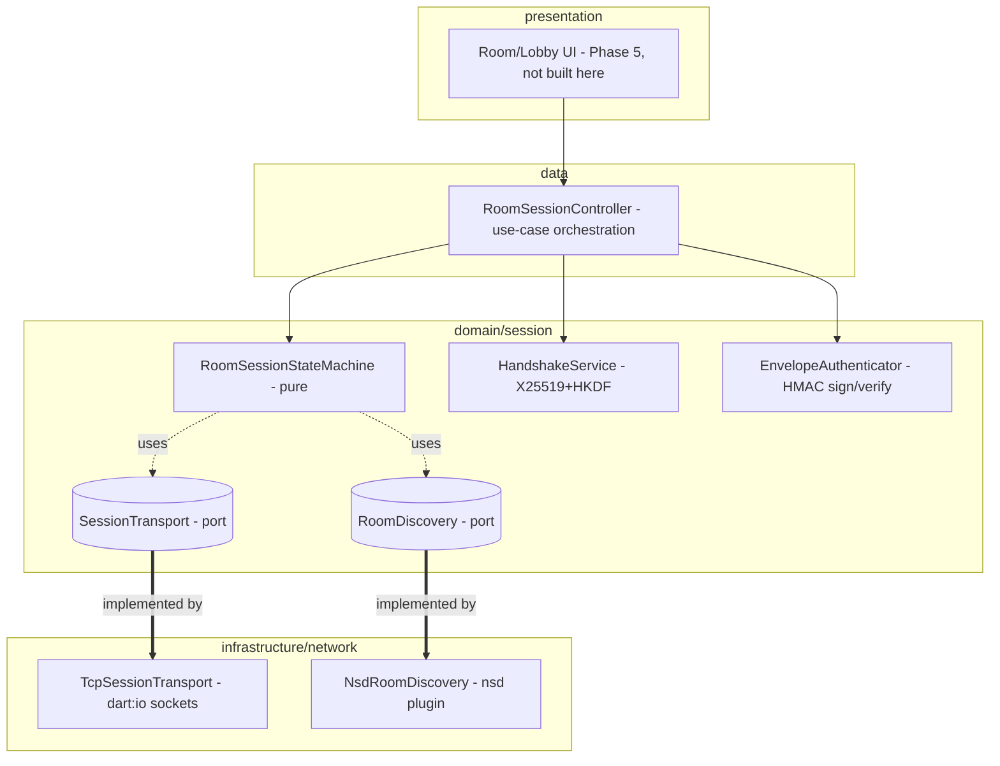

# Session & Networking Design

**Spec**: `.specs/features/session-networking/spec.md`
**Status**: Draft

---

## Architecture Overview

Star topology confirmed in spec Assumptions: every participant holds one direct TCP connection to the master; no visitor-to-visitor links. The master's device runs a `ServerSocket`; every other device runs a client `Socket`. All session logic — state machine, handshake math, envelope auth — lives in `domain/session/` as pure Dart (no Flutter, no plugin, no `dart:io`). Transport (`dart:io` sockets) and discovery (`nsd` mDNS) live in `infrastructure/network/` behind two domain-owned ports (`SessionTransport`, `RoomDiscovery`), so the state machine is unit-testable without a real socket.



---

## Code Reuse Analysis

### Existing Components to Leverage

| Component | Location | How to Use |
| --- | --- | --- |
| `Result<S, F>` / `Failure` | `lib/domain/core/` | All new domain operations return `Result<S, TypedFailure>`, per AD-002 |
| `Unit` | `lib/domain/core/unit.dart` | Return type for state-machine transitions with no payload (approve, reject, expire) |
| Layer-purity check | `.claude/skills/.../check_layers.py` (AD-001) | Re-run after adding `domain/session/` to confirm no Flutter/plugin/`dart:io` leaks in |
| `crypto` package (already in `pubspec.yaml`) | n/a | `Hmac(sha256, key)` for envelope authentication (NET-10/11) |
| `nsd` package (already in `pubspec.yaml`) | n/a | mDNS advertise (master) / discover (visitor) behind `RoomDiscovery` port |

### Integration Points

| System | Integration Method |
| --- | --- |
| Future Phase 4 (file transfer) | Will send its chunks as opaque `Envelope.payload` bytes through the same `SessionTransport` — this feature does not know what's inside a payload |
| Future Phase 5 (master room / singer player UI) | Will call `RoomSessionController` use-cases and listen to its `Stream<RoomSessionSnapshot>` — no UI is built in this feature |

---

## Components

### `RoomSessionStateMachine` (domain)

- **Purpose**: Pure state machine owning room/participant lifecycle — capacity, join-request expiry, approval, TTL expiry, disconnect. No I/O.
- **Location**: `lib/domain/session/room_session_state_machine.dart`
- **Interfaces**:
  - `Result<Unit, Failure> requestJoin(DeviceId id, String code, DateTime now)` — NET-03/04/08/09
  - `Result<ParticipantId, Failure> approve(ParticipantId id, DateTime now)` — NET-05/06/08, returns the id to hand to `HandshakeService`
  - `Result<Unit, Failure> reject(ParticipantId id)` — NET-06
  - `Result<Unit, Failure> completeHandshake(ParticipantId id, Uint8List sessionKey)` — NET-05/07
  - `Result<Unit, Failure> acceptEnvelope(Envelope envelope, DateTime now)` — NET-10..15 (delegates HMAC/sequence checks to `EnvelopeAuthenticator`, applies role check itself)
  - `Result<Unit, Failure> disconnect(ParticipantId id)` — NET-17
  - `Unit tick(DateTime now)` — NET-16/18, expires join requests (60s) and participants (30min); pure function, no `Timer` inside
  - `RoomSessionSnapshot get snapshot` — read-only view for the controller/UI
- **Dependencies**: `EnvelopeAuthenticator` (injected), none on I/O
- **Reuses**: `Result`/`Unit`/`Failure` from `domain/core`

### `HandshakeService` (domain)

- **Purpose**: Generates an ephemeral X25519 keypair, computes the ECDH shared secret against the peer's public key, derives a 32-byte session key via HKDF-SHA256.
- **Location**: `lib/domain/session/handshake_service.dart`
- **Interfaces**:
  - `EphemeralKeyPair generateEphemeralKeyPair()`
  - `Future<Result<Uint8List, Failure>> deriveSessionKey(EphemeralKeyPair self, Uint8List peerPublicKey)` — NET-05/07
- **Dependencies**: `cryptography` package (X25519 `KeyExchangeAlgorithm`, `Hkdf`) — **new dependency, not yet in `pubspec.yaml`**, see Tech Decisions
- **Reuses**: none (new domain capability)

### `EnvelopeAuthenticator` (domain)

- **Purpose**: Signs outgoing envelopes and verifies incoming ones (HMAC + strictly-increasing sequence), constant-time compare.
- **Location**: `lib/domain/session/envelope_authenticator.dart`
- **Interfaces**:
  - `Envelope sign(ParticipantId sender, int sequence, Uint8List payload, Uint8List key)` — NET-10
  - `Result<Unit, Failure> verify(Envelope envelope, Uint8List key, int lastAcceptedSequence)` — NET-11/12/13/14
- **Dependencies**: `crypto` package (`Hmac`, `sha256`)
- **Reuses**: nothing existing — new, but uses already-declared `crypto` dep

### `SessionTransport` (domain port) / `TcpSessionTransport` (infrastructure)

- **Purpose**: Byte-level send/receive per participant connection; domain never touches `dart:io`.
- **Location**: port `lib/domain/session/session_transport.dart`; impl `lib/infrastructure/network/tcp_session_transport.dart`
- **Interfaces** (port):
  - `Future<void> listen(int port)` — master side, binds a `ServerSocket`; `port: 0` lets the OS assign one
  - `int get boundPort` — the actual bound port after `listen()`, needed when `port: 0` was used
  - `Future<ParticipantId> connect(String host, int port)` — visitor side, opens an outbound connection; returns a transport-assigned connection handle
  - `Stream<ParticipantId> get incomingConnections` (master side) — a transport-assigned connection handle per accepted socket; this is a connection handle, not yet a domain-verified participant identity (the controller correlates it to a real `ParticipantId` once the join-request payload arrives)
  - `Stream<ParticipantId> get closedConnections` — emits when a connection closes from the *peer's* side (clean or abrupt), so the controller can call `RoomSessionStateMachine.disconnect()` (NET-17); does not fire for a close this side initiated itself via `close()`
  - `Stream<Uint8List> receive(ParticipantId id)`
  - `Future<void> send(ParticipantId id, Uint8List bytes)`
  - `Future<void> close(ParticipantId id)`
- **Dependencies** (impl): `dart:io` `ServerSocket`/`Socket`
- **Reuses**: none existing — first networking code in the project
- **Design addendum (filled during T13 implementation):** the original 4-method sketch above had no way to actually open a connection, bind a port, or learn about a peer-initiated close — all required by T13's own acceptance criteria. Added `listen`/`boundPort`/`connect`/`closedConnections` to close that gap.

### `RoomDiscovery` (domain port) / `NsdRoomDiscovery` (infrastructure)

- **Purpose**: Advertise a room (master) / discover rooms (visitor) over mDNS, carrying only `roomId` + service name — never the 4-digit code or any key material.
- **Location**: port `lib/domain/session/room_discovery.dart`; impl `lib/infrastructure/network/nsd_room_discovery.dart`
- **Interfaces** (port):
  - `Future<void> advertise(RoomId id, int port)` — mDNS registration needs the master's actual TCP port; the original sketch omitted it
  - `Stream<DiscoveredRoom> discover()` — cancelling the subscription stops the underlying mDNS discovery (no separate `stopDiscovery` method needed)
  - `Future<void> stopAdvertising()`
- **`DiscoveredRoom`** (domain value object, filled during T14 — not in the original Data Models section): `{ RoomId id; String host; int port; }`, enough for a visitor to open a `SessionTransport.connect(host, port)` call
- **Dependencies** (impl): `nsd` package (already declared)
- **Reuses**: none existing

### `RoomSessionController` (data/use-case orchestration)

- **Purpose**: Wires state machine + handshake service + transport + discovery together; the only thing a future presentation layer calls. Converts domain `Failure`s into the same `Result` contract, owns the periodic `tick()` timer (this is where `Timer.periodic` legitimately lives — infrastructure-adjacent orchestration, not pure domain).
- **Location**: `lib/data/session/room_session_controller.dart`
- **Interfaces**:
  - `Future<Result<RoomId, Failure>> createRoom()`
  - `Stream<DiscoveredRoom> discoverRooms()`
  - `Future<Result<Unit, Failure>> requestJoin(RoomId room, String code)`
  - `Future<Result<Unit, Failure>> approve(ParticipantId id)` / `reject(ParticipantId id)`
  - `Future<void> endRoom()` — NET-20, filled during Verifier fix-up: the original sketch never gave the controller an end-room operation at all, leaving `RoomSessionStateMachine.endRoom()` and `RoomDiscovery.stopAdvertising()` as dead code with no caller
  - `Stream<RoomSessionSnapshot> get snapshots`
- **Dependencies**: `RoomSessionStateMachine`, `HandshakeService`, `SessionTransport`, `RoomDiscovery`
- **Reuses**: Riverpod DI wiring pattern already used for `SongRepository` (per `flutter-clean-architecture` skill conventions)

---

## Data Models

### `Room` (domain entity)

```dart
class Room {
  final RoomId id;
  final String code;       // 4 digits, fixed for room lifetime
  final DeviceId masterId;
  final RoomLifecycle state; // advertising | ended
}
```

### `ParticipantSession` (domain entity)

```dart
class ParticipantSession {
  final ParticipantId id;
  final ParticipantRole role;        // master | visitor
  final ParticipantState state;      // pendingApproval | approved | connected | rejected | disconnected | expired
  final Uint8List? sessionKey;       // null until handshake completes
  final int lastAcceptedSequence;    // starts at -1 (no messages yet)
  final DateTime lastActivityAt;     // monotonic-ish; master's local clock
  final DateTime? pendingSince;      // set only while pendingApproval, drives 60s expiry
}
```

**Relationships**: `Room` 1 — N `ParticipantSession`. State machine owns both; neither is persisted (ephemeral, in-memory only — confirmed out of scope for SQLite).

### `Envelope` (domain value object)

```dart
class Envelope {
  final ParticipantId senderId;
  final int sequence;
  final Uint8List payload;   // opaque to this feature
  final Uint8List hmac;      // 32 bytes, SHA-256
}
```

### Failure codes (reuses existing `domain/core/failures.dart` types — AD-002 convention)

No new sealed hierarchy. Every operation returns one of the four existing `Failure` subclasses with a feature-specific `code`, matching how `SongRepository` already does it:

| Scenario | Failure type | `code` |
| --- | --- | --- |
| Wrong 4-digit code | `ValidationFailure` | `session.invalid-code` |
| Room at 8/8 | `ValidationFailure` | `session.room-full` |
| Join request expired (60s) | `ValidationFailure` | `session.join-request-expired` |
| Handshake math failed/timed out | `NetworkFailure` | `session.handshake-failed` |
| HMAC mismatch | `NetworkFailure` | `session.hmac-mismatch` |
| Replay detected | `NetworkFailure` | `session.replay-detected` |
| Visitor sent Master-only message | `ValidationFailure` | `session.unauthorized-role` |
| Unknown participant id | `NotFoundFailure` | `session.participant-not-found` |

**Relationships**: Returned by every `RoomSessionStateMachine` / `HandshakeService` / `EnvelopeAuthenticator` operation per AD-002 — never thrown.

---

## Error Handling Strategy

| Error Scenario | Handling | User Impact |
| --- | --- | --- |
| Wrong 4-digit code | `ValidationFailure(code: 'session.invalid-code')`, no pending entry created (NET-04) | Visitor sees "code not recognized" (UI maps code in Phase 5) |
| Room at 8/8 | `ValidationFailure(code: 'session.room-full')` at request/approve/reconnect (NET-08) | Visitor sees "room is full" |
| Join request not approved in 60s | Auto-rejected by `tick()` (NET-09) | Visitor sees "request timed out" |
| Handshake math fails / times out >10s | `NetworkFailure(code: 'session.handshake-failed')`, participant never admitted (NET-07) | Visitor sees "could not connect securely" |
| Envelope HMAC mismatch | Silently discarded, state untouched (NET-11) | No user-visible error — this is adversarial traffic, not a normal failure |
| Envelope replay (sequence ≤ last accepted) | Silently discarded, state untouched (NET-12) | Same — no user-visible error |
| Visitor sends Master-only message | `ValidationFailure(code: 'session.unauthorized-role')`, discarded (NET-14) | Visitor's client-side UI should prevent this; server-side rejection is defense-in-depth |
| Participant silent 30 min | Expired by `tick()`, slot freed, socket closed (NET-16) | Participant sees "disconnected — rejoin" |
| TCP socket closes (clean or abrupt) | `disconnect()` called from transport's connection-closed event, slot freed immediately (NET-17) | Same as above, but faster than waiting for TTL |

---

## Wire Protocol (addendum, filled during T15 implementation)

Design.md never specified how bytes on the `SessionTransport` connection are structured — `SessionTransport.send`/`receive` move raw bytes over a TCP byte stream, which has no inherent message boundaries. `RoomSessionController` needs this to actually drive the P1/P2 flows, so it is defined here rather than invented silently inside the implementation.

**Framing**: every message is a frame: a 4-byte big-endian length prefix followed by that many payload bytes. `TcpSessionTransport.receive()` can deliver a partial frame, multiple frames in one chunk, or a frame split across chunks — `lib/data/session/frame_codec.dart` buffers raw chunks and reassembles complete frame payloads before anything is decoded.

**Message types** (`lib/data/session/session_wire_message.dart`, 1-byte type tag + body, used as the frame payload):

| Tag | Message | Body | Direction |
| --- | --- | --- | --- |
| `0x01` | `JoinRequestMessage` | `deviceId` (u16 len + utf8), `code` (u16 len + utf8) | visitor → master |
| `0x02` | `JoinRejectedMessage` | `reasonCode` (u16 len + utf8) | master → visitor |
| `0x03` | `HandshakeInitMessage` | `publicKey` (u16 len + bytes) | master → visitor, sent right after `approve()` |
| `0x04` | `HandshakeResponseMessage` | `publicKey` (u16 len + bytes) | visitor → master, completes the ECDH exchange |
| `0x05` | `EnvelopeMessage` | `requiresMasterRole` (1 byte bool), `senderId` (u16 len + utf8), `sequence` (8-byte BE int), `hmac` (32 bytes), `payload` (u32 len + bytes) | either direction, post-handshake |

**Sequence**: visitor connects → sends `JoinRequestMessage` → master calls `requestJoin`; on failure sends `JoinRejectedMessage` and closes; on success the pending participant appears in `snapshots` for the local app to decide. On `approve(id)`, master generates an ephemeral keypair and sends `HandshakeInitMessage`; the visitor derives its session key and replies with `HandshakeResponseMessage`; the master derives the same key and calls `completeHandshake`. From there, either side may send `EnvelopeMessage` frames authenticated by `EnvelopeAuthenticator`.

`requiresMasterRole` travels in the clear (outside the HMAC) — this is safe because it is not a security boundary by itself: `acceptEnvelope`'s role check (T11) validates against the *stored* session role, not against whatever a sender claims, so a Visitor cannot grant itself Master privilege by setting this bit.

**Visitor-side session tracking**: `RoomSessionStateMachine` is a master-only, multi-participant admission authority (capacity, approve/reject). A visitor has exactly one peer (the master) and never makes admission decisions, so the visitor side of `RoomSessionController` tracks its own session key, outgoing sequence counter, and last-accepted-from-master sequence directly, calling `EnvelopeAuthenticator`/`HandshakeService` without going through `RoomSessionStateMachine`.

---

## Post-Verification Fixes (addendum)

The independent Verifier found 7 gaps after T1-T17 were implemented. The real defects and missing wiring (as opposed to test-coverage gaps) were:

- **Pre-auth session reset (security bug).** `RoomSessionStateMachine.requestJoin` unconditionally overwrote any existing `ParticipantSession` for a `deviceId`, so a device that merely knew the (non-secret, discovery-only) 4-digit code could reset an already-admitted participant — wiping its session key and freeing its slot — without any authentication. Fixed: `requestJoin` now rejects (`session.already-joined`) unless the existing session, if any, is `rejected`/`disconnected`/`expired` (the only states NET-18 allows a fresh join to replace).
- **NET-07 / spec Edge Case 2 (slot leak).** `approve()` moved a participant to `approved` before the handshake, but nothing ever timed that out if the handshake stalled — the slot was held forever. Fixed: `ParticipantSession` gained `approvedSince`; `tick()` now rejects (frees the slot) an `approved` participant whose handshake hasn't completed within 10s, matching the spec's stated handshake timeout.
- **NET-20 had no caller.** `RoomSessionController.endRoom()` didn't exist — `RoomSessionStateMachine.endRoom()` and `RoomDiscovery.stopAdvertising()` were unreachable dead code. Added `RoomSessionController.endRoom()` (see Components above).
- **NET-06 / NET-16 didn't close sockets.** `reject()` and tick-driven expiry (`expired`/`rejected`) updated domain state but never closed the participant's actual TCP connection. Fixed: both now close the transport connection via a shared `_closeConnectionFor` helper.

---

## Risks & Concerns

| Concern | Location | Impact | Mitigation |
| --- | --- | --- | --- |
| `cryptography` package is a new, undeclared dependency | `pubspec.yaml` | AD-004 says all MVP deps are declared from Phase 0 — this one wasn't foreseen | Add it in Task 1 of this feature; document as AD-011 (amendment, same pattern as AD-009 amended AD-004 for `drift`) |
| HMAC/key comparison via naive `==` on `List<int>` is not constant-time in Dart | `EnvelopeAuthenticator.verify` (new code) | Timing side-channel could help an attacker brute-force forge a valid HMAC over many attempts on a LAN | Design mandates a constant-time byte compare helper in `domain/core/` (`constantTimeEquals(Uint8List, Uint8List)`), used by `verify()` instead of `==` |
| First networking code in the project — no existing TCP/mDNS patterns to copy | `lib/infrastructure/network/` (new dir) | Higher risk of subtle socket-lifecycle bugs (half-closed sockets, backpressure) | Scoped by this feature's Out of Scope: no file transfer yet, payloads are small control messages only; Phase 4 revisits transport for large payloads |
| `tick()` must be called regularly by someone, or TTL/expiry never fires | `RoomSessionController` (new code) | A forgotten timer wiring silently disables NET-09/NET-16 | Task list must include an explicit task + test asserting `tick()` is invoked on a periodic timer by the controller, not just that `tick()` itself works in isolation |

---

## Tech Decisions

| Decision | Choice | Rationale |
| --- | --- | --- |
| Asymmetric handshake crypto | `cryptography` pub package (X25519 ECDH + HKDF-SHA256) | Pure-Dart, no platform channel (keeps it legal inside `domain/` per AD-001); the already-declared `crypto` package has no asymmetric/KDF primitives, only hashes/HMAC |
| HMAC | Existing `crypto` package (`Hmac(sha256, key)`) | Already declared (AD-004); no reason to duplicate with `cryptography`'s HMAC |
| TTL/expiry mechanism | Pure `tick(DateTime now)` on the state machine, driven by a `Timer.periodic` in `RoomSessionController` (infrastructure-adjacent, not domain) | Keeps TTL logic unit-testable with injected `DateTime` values instead of real wall-clock waits in tests |
| Transport | Raw `dart:io` `ServerSocket`/`Socket` behind `SessionTransport` port | No higher-level RPC/websocket library justified for an 8-peer LAN star topology; matches "Authenticated TCP" from CLAUDE.md directly |

> **Project-level decision**: Adding `cryptography` as a new runtime dependency is a project-level decision (amends AD-004's "all deps declared from Phase 0" to acknowledge one unforeseen addition, same pattern as AD-009). Will append **AD-011** to `.specs/STATE.md` once this design is approved.

---

## Tips

(n/a — implementation notes, not part of the delivered doc)
